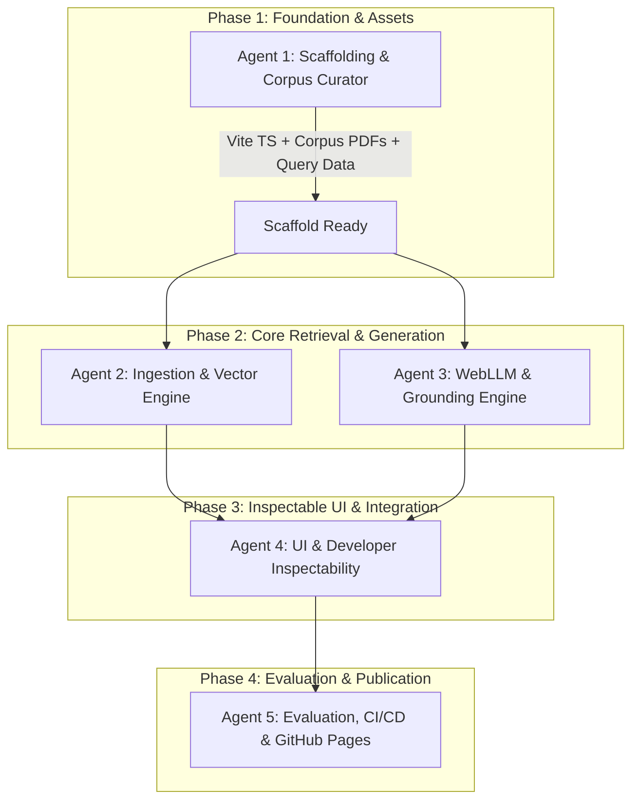

# Implementation & Sub-Agent Orchestration Plan: Client-Only In-Memory Browser RAG

## 1. Project Goal & Architecture Overview

Build and publish a zero-backend, 100% client-side Retrieval-Augmented Generation (RAG) web application based on [concept.md](concept.md).

* **Corpus:** 21 Northstar Urgent Care Cooperative operational PDFs (~64 pages, non-clinical corporate policies).
* **Ingestion & Extraction:** `pdfjs-dist` per-page text extraction with metadata tagging.
* **Vector Embeddings:** `@huggingface/transformers` (`Xenova/all-MiniLM-L6-v2`, ONNX Web/WASM, 384d normalized).
* **Vector Storage & Search:** Direct flat `Float32Array` heap storage and $O(N)$ linear dot-product similarity.
* **In-Browser Generation:** `@mlc-ai/web-llm` running `Llama-3.2-1B-Instruct-q4f16_1-MLC` via WebGPU (with graceful fallback to semantic retrieval mode when WebGPU is unavailable).
* **Host & Delivery:** Static single-page application (Vite + TypeScript) deployable to GitHub Pages.
* **Evaluation & Demo:** Interactive test suite and sample query chips based on `QUERY-EXAMPLES.md` (10 positive queries, 5 negative guardrail queries).

---

## 2. Recommended Sub-Agent Architecture

To ensure separation of concerns, high code quality, and verifiable milestones, the work is partitioned into specialized roles:

| Sub-Agent Role | Scope & Responsibilities | Key Outputs |
| :--- | :--- | :--- |
| **Agent 1: Scaffolding & Corpus Curator** | Vite + TypeScript application setup, corpus asset retrieval (downloading/bundling the 21 Northstar PDFs & evaluation queries), Tailwind/styling setup, build configurations. | Working Vite app, static corpus files in `public/corpus/`, evaluation query definitions in `src/data/`. |
| **Agent 2: Extraction & Vector Engine** | PDF ingestion (`pdfjs-dist`), sliding-window chunker, Transformers.js embedding worker, in-memory `Float32Array` store, cosine similarity engine. | `src/engine/pdfExtractor.ts`, `src/engine/chunker.ts`, `src/engine/vectorStore.ts`, embedding worker. |
| **Agent 3: Generation & Grounding Engine** | WebGPU detection, `@mlc-ai/web-llm` integration, model download progress tracking, prompt assembly with citation contracts, streaming response generator, fallback handler. | `src/engine/webLLM.ts`, `src/engine/promptAssembler.ts`, fallback/Ollama client. |
| **Agent 4: UI & Developer Inspectability** | Visual UI: drag-and-drop / preload corpus bar, interactive chat interface with citations, 15 evaluation query chips, DevTools inspection drawer (chunk viewer, vector similarity rankings, prompt preview). | App UI components (`ChatView`, `DevToolsDrawer`, `CorpusStatus`, `QueryChips`). |
| **Agent 5: Evaluation & Automated CI / Deployment** | Running and verifying the 15 evaluation queries, build bundle optimization, GitHub Actions workflow for GitHub Pages deployment, README documentation. | `.github/workflows/deploy.yml`, build verification, documentation, test harness. |

---

## 3. Phased Execution Roadmap

---

## 4. Detailed Phase Tasks & Milestones

### Phase 1: Scaffolding & Corpus Setup (Agent 1)
- [ ] Initialize project with Vite + TypeScript (`npm create vite@latest . -- --template vanilla-ts` or React/Tailwind depending on preference; pure TypeScript/Tailwind recommended for zero bloat).
- [ ] Download the 21 Northstar operational PDFs from `jpeckenpaugh/rag-data-synthesizer` into `public/corpus/`.
- [ ] Create `corpus-manifest.json` indexing document titles, IDs, version status, and page counts.
- [ ] Parse `QUERY-EXAMPLES.md` into structured TypeScript objects (`queries.ts`) with query text, target citations, expected responses, and category (answerable vs. negative/guardrail).
- [ ] Configure `vite.config.ts` with cross-origin headers required for Web Workers and WebGPU/WASM where necessary (`Cross-Origin-Embedder-Policy`, `Cross-Origin-Opener-Policy`).

### Phase 2: Retrieval & Vector Engine (Agent 2)
- [ ] Implement `PDFExtractor` using `pdfjs-dist`: extract text per page while preserving line breaks, page numbers, and doc ID headers.
- [ ] Implement `Chunker`:
  - 500-character target window with 100-character overlap.
  - Prefix metadata (Document ID, Title, Status, Page) to each chunk text to ensure high semantic relevance.
  - Drop chunks $< 60$ characters.
- [ ] Implement `EmbeddingPipeline`:
  - Worker-based or async execution of `@huggingface/transformers` (`Xenova/all-MiniLM-L6-v2`).
  - Output normalized `Float32Array` (384 dimensions).
- [ ] Implement `InMemoryVectorStore`:
  - Array allocation `ChunkRecord[]`.
  - Linear scan dot-product similarity computation function.
  - Top-$K$ ranking return with similarity thresholds.

### Phase 3: WebGPU & Generation Engine (Agent 3)
- [ ] Implement `WebGPUSupport`: Detect WebGPU capability (`navigator.gpu`). If unavailable, activate fallback mode (Retrieval-Only mode or optional local Ollama proxy).
- [ ] Implement `WebLLMClient`:
  - Load `Llama-3.2-1B-Instruct-q4f16_1-MLC` with granular download and caching progress callbacks (`initProgressCallback`).
  - Streaming generation API wrapper.
- [ ] Implement `PromptAssembler`:
  - Context formatting matching the strict grounding template specified in `concept.md`.
  - Clear citation labels: `[Source: NU-OPS-XXX.pdf, Page: Y]`.
  - Anti-hallucination instructions to abstain if context is insufficient.

### Phase 4: UI & Developer Inspectability (Agent 4)
- [ ] Build layout:
  - **Header:** Model loading progress bar, WebGPU status pill, corpus index summary (PDF count, chunk count, vector memory).
  - **Main Chat:** Conversational stream, highlighted citations with page badges, click-to-preview source snippets.
  - **Quick Test Rail:** 15 sample query chips grouped into *Answerable* and *Negative / Guardrails*.
  - **DevTools Drawer (Teaching Vehicle):**
    - Step 1: Raw extracted text & chunk visualization.
    - Step 2: Vector embedding viewer (dimensions, norms).
    - Step 3: Cosine similarity scores breakdown for the last query.
    - Step 4: Raw assembled system prompt fed into the LLM.

### Phase 5: Verification, CI/CD & Publishing (Agent 5)
- [ ] Run benchmark evaluation against all 15 queries in `QUERY-EXAMPLES.md`:
  - Verify that answerable queries cite correct PDF/page numbers.
  - Verify that negative queries abstain without hallucinating.
- [ ] Implement GitHub Actions workflow (`.github/workflows/deploy.yml`) for static build and GitHub Pages deployment.
- [ ] Verify production build bundle size, WASM chunk loading, and offline cache behavior.
- [ ] Finalize `README.md` with architectural walkthrough, local run instructions, and live deployment link.

---

## 5. Risk Assessment & Mitigations

1. **WebGPU Hardware Compatibility:**
   * *Risk:* Users on older devices or certain Linux/mobile browsers will not have WebGPU support.
   * *Mitigation:* The system detects `navigator.gpu` immediately; if unsupported, it gracefully switches to "Semantic Retrieval Mode" showing the top matched snippets and scores with an explanation banner.
2. **Initial Model Download Size:**
   * *Risk:* Llama 3.2 1B is ~800 MB; on slow networks this causes initial latency.
   * *Mitigation:* Transparent progress bar showing bytes downloaded; Cache Storage API persists weights across sessions so downloads occur once.
3. **WASM / Worker Cross-Origin Isolation:**
   * *Risk:* Certain ONNX / WebGPU features require COOP/COEP headers.
   * *Mitigation:* Ensure Vite dev server and production static hosting configurations handle asset headers and web worker packaging smoothly without complex server requirements.
