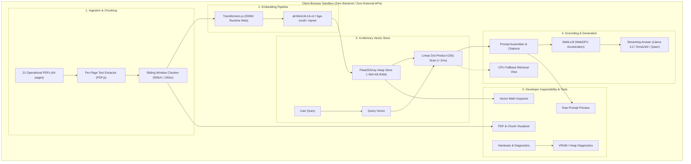

# Client-Only In-Memory Browser RAG Proof-of-Concept

[](https://github.com/jpeckenpaugh/rag-poc/actions/workflows/deploy-01.yml)
[](https://jpeckenpaugh.github.io/rag-poc/)

> **Live Demo:** [https://jpeckenpaugh.github.io/rag-poc/](https://jpeckenpaugh.github.io/rag-poc/)

A **100% client-side, zero-backend Retrieval-Augmented Generation (RAG)** single-page application running entirely inside modern web browsers. All document parsing, text chunking, ONNX embedding generation, vector similarity indexing, and large language model generation occur locally on your machine with zero server-side compute or external API calls.

---

## 🚀 Key Highlights & Architectural Overview



### Architectural Principles

1. **Zero Backend Required:** Fully static bundle hosted on GitHub Pages. No backend microservices, vector databases (like Pinecone or Weaviate), or cloud LLM endpoints (like OpenAI or Anthropic).
2. **Private & Secure:** Your queries, documents, embeddings, and completions never leave your browser sandbox.
3. **In-Memory Heap Vector Index:** 367 chunk embeddings stored as contiguous `Float32Array` buffers directly in JavaScript memory. Similarity search runs via high-speed linear dot-product vector mathematics ($O(N)$, $< 2\text{ ms}$ for the entire corpus).
4. **WebGPU Local Inference:** Powered by `@mlc-ai/web-llm` running `Llama-3.2-1B-Instruct-q4f16_1-MLC` (~880 MB weights cached locally in browser Cache Storage / IndexedDB).
5. **Configurable Models & Pipelines:** Hot-swap between 4 WebGPU LLMs (`Llama-3.2-1B`, `SmolLM2-1.7B`, `Qwen2.5-0.5B`, `Qwen2.5-1.5B`) and 4 ONNX embedding models (`all-MiniLM-L6-v2`, `bge-small-en-v1.5`, `paraphrase-MiniLM-L3`, `all-mpnet-base-v2`).
6. **Graceful Fallback:** Automatically detects WebGPU support (`navigator.gpu`). If WebGPU is unavailable or disabled, the app falls back to **Semantic Retrieval Mode**, displaying ranked chunk matches, cosine similarity scores, and source evidence.
7. **Educational DevTools & PDF Viewer:** Built-in PDF reader with canvas rendering, visual chunk inspection side-by-side, vector norms breakdown, and raw system prompt inspectability.

---

## 📚 The Corpus: Northstar Urgent Care Cooperative

The demo is preloaded with the official operational non-clinical policy corpus of **Northstar Urgent Care Cooperative**:

* **Documents:** 21 operational policy and governance PDFs (`NU-OPS-001` through `NU-OPS-020`).
* **Page Count:** 64 total pages of operational standards, governance, facilities, and access controls.
* **Indexed Chunks:** ~367 chunks with rich metadata headers (`[Document: NU-OPS-XXX.pdf | Title: ... | Status: Active | Page: Y]`).
* **Total Vector Memory:** ~564 KB RAM in standard `Float32Array` buffers.

---

## 🧪 Evaluation Benchmark & Guardrail Queries

The application features a dedicated **Evaluation Query Bar** with 15 pre-configured benchmark queries:

* **10 Answerable Queries:** Verified factual extractions across routine opening handoffs (`NU-OPS-002`), facilities procedure versioning (`NU-OPS-003` superseding `NU-OPS-016`), service interruption escalation timing (`NU-OPS-006`), and monthly metrics deadlines (`NU-OPS-019`).
* **5 Guardrail & Negative Queries:** Verified strict model abstentions against:
  * Out-of-domain medical queries (e.g. ibuprofen dosage).
  * Out-of-domain insurance/copay inquiries.
  * Unestablished regular Friday office hours (preventing confusion with temporary Harbor Point exceptions).
  * Open/unresolved policy questions (vendor record retention, backup deputy roles).

---

## 🛠️ Local Development & Build

### Prerequisites
* **Node.js:** `v20+` or `v22+`
* **Browser:** Chrome, Edge, or Safari with WebGPU support enabled (for local LLM inference).

### Installation & Run

```bash
# Clone the repository
git clone https://github.com/jpeckenpaugh/rag-poc.git
cd rag-poc

# Install dependencies
npm install

# Start local development server
npm run dev
```

Visit `http://localhost:5173/rag-poc/` in your browser.

### Production Build

```bash
npm run build
```

The production assets will be output to `./dist/` ready for static deployment.

---

## 📄 License

MIT License. Designed for education, research, and zero-backend web architecture demonstrations.
